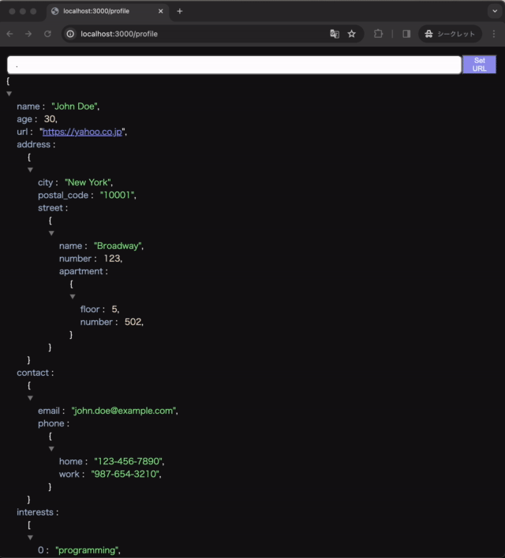

<div align="center">
  
# JSON viewer +jq

**jq 絞り込みができる JSON viewer chrome 拡張**

[](https://open.vscode.dev/nusuke/chrome-extention-json-viewer-jq)



</div>

# 機能

- JSON レスポンスの場合、Viewer を表示
- jq クエリによる絞り込み
- URL query param に `chromeExtentionJqQuery`　を追加することで「JSON viewer +jq」を install 済みの方と共有可能

# 開発環境用意

```
npm ci --force
npm run build:debug
```

build/配下を `chrome://extensions/`で読み込み

# Contact

ご意見: https://forms.gle/9FcMRYKUq3sXXR8z8
もしくは、 GitHub の issue へ。
